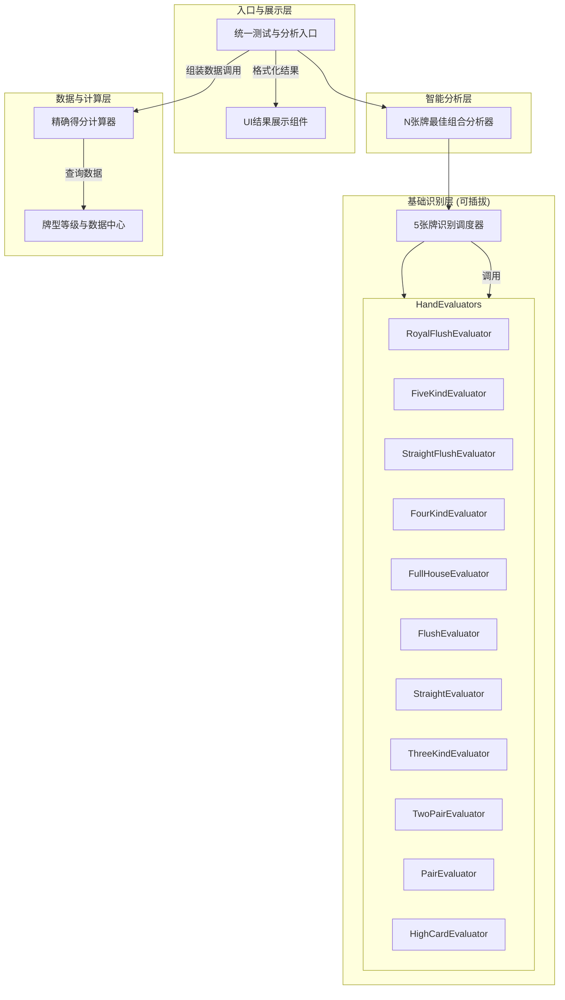

好的，完全理解。您的核心需求是：
1.  **公式的极致拆解**：需要一个极其明确、分步的最终得分计算公式，将所有变量都清晰地暴露出来，以便于后续调整和扩展。
2.  **踢脚牌的明确处理**：系统需要识别出踢脚牌，但当前的计分公式必须**显式地不包含**它们的值，为未来可能的引入预留接口。
3.  **可验证的返回值**：系统必须返回所有中间计算值（基础分、牌面分、倍率等），以便您能轻松验证每一步的逻辑是否正确。

基于这些要求，我为您重构了这份 **V2.1 版本**的详细设计文档。它将提供您所需要的全部细节。

---

## 🎯 奥术学院扑克 - V2.1 精确化计分与扩展性设计文档 📋

### 文档概述
本文档为《奥术学院扑克》核心系统的 V2.1 版本设计指南。V2.1 的核心目标是**精确化计分逻辑**并**最大化系统扩展性**。它在前序版本的基础上，对得分公式进行了原子化拆解，并明确了踢脚牌（Kicker）在系统中的角色——**识别但不计分**，为未来的游戏设计预留了充分的灵活性。

**V2.1 核心设计理念：**
*   **公式透明化 (Formula Transparency):** 最终得分的每一个组成部分都将被清晰定义、计算和返回，杜绝任何“黑盒”逻辑。
*   **数据隔离 (Data Isolation):** 牌型识别（是什么牌）与牌型计分（值多少分）在逻辑上分离，踢脚牌数据被保留用于比大小，但不进入计分流程。
*   **模块化与可插拔架构 (Modular & Pluggable Architecture):** 沿用并强化可插拔的评估器（Evaluator）设计，添加新牌型或新规则对现有系统的侵入性降至最低。
*   **数据驱动 (Data-Driven):** 所有核心平衡数值（基础分、倍率、系数）均由外部数据定义，便于策划进行快速迭代。

---

### 🏗️ 模块化系统架构
系统架构保持 V2.0 的高效分层设计，核心在于**可插拔的牌型评估器**。


**工作流程**：`SmartHandAnalyzer`找到最佳5张牌组合后，`PokerHandAnalyzer`通过调度`HandEvaluators`确定其牌型，并生成一个包含**牌型、核心牌值和踢脚牌**的`HandResult`对象。最后，`ScoreCalculator`根据这个`HandResult`和`HandRankingSystem`的数据，计算出包含所有中间步骤的`ScoreResult`对象。

---
### 🃏 动态牌型等级系统
此部分数据不变，由 `HandRankingSystem` 管理，从外部数据文件加载。

| 等级 | 牌型 | 英文名 | 基础分 | LV1倍率 | 每级增量 | LV5倍率 |
| :--- | :--- | :--- | :--- | :--- | :--- | :--- |
| 1 | 高牌 | `HIGH_CARD` | 1 | 1.0x | +0.2x | 1.8x |
| ... | ... | ... | ... | ... | ... | ... |
| 11 | 五条 | `FIVE_KIND` | 144 | 50.0x | +10.0x | 90.0x |

---
### 🎯 精确化最终得分计算系统 (V2.1 核心)

本节将对得分公式进行最详尽的拆解，确保每个变量的来源和计算方式都清晰可见。

#### 1. 原子化最终得分公式

**`最终得分 (FinalScore)` = `ROUND( (基础牌型分 + 牌面价值分 + 附加分) × 动态倍率 )`**

| 变量名 | 英文变量 | 计算来源 / 获取方式 | 说明 |
| :--- | :--- | :--- | :--- |
| **基础牌型分** | `baseScore` | `HandRankingSystem.get_base_score(handType)` | 牌型固定的基础分值，代表其稀有度。 |
| **牌面价值分** | `valueScore` | `ScoreCalculator.calculate_value_score(handResult)` | **核心变化点**，仅由构成牌型的核心卡牌计算得出。 |
| **附加分** | `bonusScore` | 从卡牌效果（蜡封、牌框）中累加 | 外部效果提供的分数，体现协同效应。 |
| **动态倍率** | `dynamicMultiplier` | `HandRankingSystem.get_multiplier(handType)` | 根据牌型等级（LV1-LV5）计算出的最终倍率。 |

#### 2. 牌面价值分 (`valueScore`) 计算规则

这是实现**逻辑验证**的关键。计算器仅使用`HandResult`中提供的核心牌值 (`PrimaryValue`, `SecondaryValue`)。

| 牌型 | 核心计分牌 | 计算公式 | `HandResult` 返回值 |
| :--- | :--- | :--- | :--- |
| 高牌 | 价值最高的1张牌 | `[最高牌值] × 2` | `PrimaryValue`: 最高牌值 |
| **一对** | 构成对子的2张牌 | `[对子牌值] × 4` | `PrimaryValue`: 对子牌值 |
| **两对** | 构成大对子的2张牌 + 构成小对子的2张牌 | `([大对子牌值] × 6) + ([小对子牌值] × 4)` | `PrimaryValue`: 大对子牌值<br>`SecondaryValue`: 小对子牌值 |
| **三条** | 构成三条的3张牌 | `[三条牌值] × 8` | `PrimaryValue`: 三条牌值 |
| 顺子 | 全部5张牌 | `[牌1+牌2+牌3+牌4+牌5]` | `PrimaryValue`: 顺子最高牌值 |
| 同花 | 全部5张牌 | `([牌1+牌2+牌3+牌4+牌5]) × 1.2` | `PrimaryValue`: 同花最高牌值 |
| **葫芦** | 构成三条的3张牌 + 构成对子的2张牌 | `([三条牌值] × 10) + ([对子牌值] × 6)` | `PrimaryValue`: 三条牌值<br>`SecondaryValue`: 对子牌值 |
| **四条** | 构成四条的4张牌 | `[四条牌值] × 15` | `PrimaryValue`: 四条牌值 |
| 同花顺 | 全部5张牌 | `([牌1+牌2+牌3+牌4+牌5]) × 2` | `PrimaryValue`: 顺子最高牌值 |
| 皇家同花顺 | (特殊) | 固定值 `200` | `PrimaryValue`: 14 (A) |
| **五条** | 构成五条的5张牌 | `[五条牌值] × 20` | `PrimaryValue`: 五条牌值 |

**A值处理**:
*   `A-2-3-4-5` 顺子/同花顺中，`A` 计为 `1`。
*   其他所有情况，`A` 计为 `14`。

#### 3. 计算示例与可验证返回值

**示例1: 两对 (Kings over Eights)**
*   **手牌**: `[K♥, K♠, 8♦, 8♣, A♣]`
*   **附加分**: 15 (来自某特殊效果)
*   **牌型等级**: 两对 LV3

**Step 1: 牌型识别 (`PokerHandAnalyzer`)**
*   **识别结果 (`HandResult`)**:
    *   `handType`: `TWO_PAIR`
    *   `primaryValue`: **13** (King)
    *   `secondaryValue`: **8** (Eight)
    *   `kickers`: `[14]` (Ace) - **此值仅用于比大小，不参与计分**

**Step 2: 得分计算 (`ScoreCalculator`)**
*   **获取变量**:
    *   `baseScore`: 3 (从`HandRankingSystem`获取`TWO_PAIR`的基础分)
    *   `valueScore`: `(primaryValue × 6) + (secondaryValue × 4)` -> `(13 × 6) + (8 × 4)` = `78 + 32` = **110**
    *   `bonusScore`: **15** (传入的附加分)
    *   `dynamicMultiplier`: `2.0 + (3 - 1) × 0.4` = `2.0 + 0.8` = **2.8x** (从`HandRankingSystem`计算LV3两对的倍率)

*   **最终计算**:
    *   `FinalScore` = `ROUND( (3 + 110 + 15) × 2.8 )`
    *   `FinalScore` = `ROUND( 128 × 2.8 )`
    *   `FinalScore` = `ROUND( 358.4 )` = **358**

**系统应返回的详细结果 (`ScoreResult` 对象)**:
```json
{
  "finalScore": 358,
  "baseScore": 3,
  "valueScore": 110,
  "bonusScore": 15,
  "totalBase": 128, // (base + value + bonus)
  "dynamicMultiplier": 2.8,
  "calculationFormula": "ROUND(((3 + 110) + 15) * 2.8)"
}
```

---
### 🔧 扩展性设计指南

#### 如何为踢脚牌增加一种新的计分方式？
假设未来想引入一个“孤高王者”效果：如果踢脚牌是A，则额外增加 `踢脚牌价值 × 等级` 的分数。

1.  **定位修改点**: `ScoreCalculator`。
2.  **修改 `calculate_score` 函数**:
    ```csharp
    public ScoreResult CalculateScore(HandResult handResult, int level, int bonusScore, GameState gameState) {
        // ... (现有计算逻辑) ...

        // 新增逻辑：检查特殊效果
        if (gameState.HasEffect("孤高王者") && handResult.Kickers.Contains(14)) {
            int kickerBonus = 14 * level;
            // 将这部分分数加到 bonusScore 或一个新的变量中
            totalBonusScore += kickerBonus; 
        }

        // ... (继续最终计算) ...
    }
    ```
**优势**: 由于`HandResult`已经将`Kickers`数据分离出来，我们可以轻松地添加新规则来利用它，而无需改动牌型识别或基础计分逻辑。

---
### 🧪 测试与调试

#### 增强的日志输出
为了便于验证，日志输出应直接反映`ScoreResult`的所有字段。

**V2.1 日志输出示例**:
```
🎯 牌型识别: 两对 (K over 8)
🃏 最佳组合: K♥, K♠, 8♦, 8♣, A♣
    - 核心牌: K♥, K♠, 8♦, 8♣
    - 踢脚牌: A♣ (不计分)
💰 得分详情 (两对 LV3):
   - 最终得分: 358
   - 计算公式: ROUND(((3 + 110) + 15) * 2.8)
   - [明细] 基础分: 3
   - [明细] 牌面分: 110 (K×6 + 8×4)
   - [明细] 附加分: 15
   - [明细] 等级倍率: 2.8x
📊 分析元数据:
   - 耗时: 1ms
   - 测试组合数: 1
```
这种格式使开发者或QA能一眼看出计算的每一步是否正确。

---
### 📚 API接口与数据结构 (V2.1)

#### `HandResult` - 牌型识别结果
职责：描述“**这是一手什么牌**”。
```csharp
public class HandResult {
    public HandType HandType { get; set; }           // 牌型枚举
    public int PrimaryValue { get; set; }            // 主要牌值 (e.g., 对子/三条的值)
    public int SecondaryValue { get; set; }          // 次要牌值 (e.g., 两对/葫芦的次级值)
    public List<Card> ContributingCards { get; set; } // 构成牌型的核心卡牌
    public List<int> Kickers { get; set; }           // 踢脚牌数值 (仅用于比大小, 不参与计分!)
}
```

#### `ScoreResult` - 得分计算结果 (新增)
职责：描述“**这手牌值多少分，以及如何算出来的**”。
```csharp
public class ScoreResult {
    public int FinalScore { get; set; }              // 最终得分 (取整后)
    public float RawScore { get; set; }              // 原始得分 (取整前)
    public int BaseScore { get; set; }               // 基础牌型分
    public int ValueScore { get; set; }              // 牌面价值分
    public int BonusScore { get; set; }              // 附加分
    public float DynamicMultiplier { get; set; }     // 动态倍率
    public string CalculationFormula { get; set; }   // 字符串形式的计算公式，用于调试
}
```

#### `HandTypeTestCore` - 统一分析接口
```csharp
// 返回一个包含所有你需要信息的封装对象
public FullAnalysisResult AnalyzeHand(List<Card> cards, int bonusScore) {
    // 1. 调用 SmartHandAnalyzer 找到最佳5张牌
    List<Card> bestHand = SmartHandAnalyzer.FindBestHand(cards);

    // 2. 调用 PokerHandAnalyzer 识别牌型
    HandResult handResult = PokerHandAnalyzer.Analyze(bestHand);

    // 3. 调用 ScoreCalculator 计算得分
    ScoreResult scoreResult = ScoreCalculator.Calculate(handResult, bonusScore);

    // 4. 组装并返回所有信息
    return new FullAnalysisResult {
        HandResult = handResult,
        ScoreResult = scoreResult,
        // ... 其他调试信息
    };
}
```

### 核心要点总结
1.  **计分公式已完全拆解**：`FinalScore = ROUND((base + value + bonus) * multiplier)`，每个变量都有明确的来源和计算方法。
2.  **踢脚牌被正确处理**：`HandResult`会携带`Kickers`数据，但`ScoreCalculator`在计算`valueScore`时会**完全忽略**它，为未来扩展提供了干净的接口。
3.  **返回值满足验证需求**：系统最终会提供一个包含`ScoreResult`的详尽结果对象，内含所有中间计算值和公式字符串，方便您进行单元测试和逻辑验证。
4.  **架构保持高度可扩展**：添加新牌型、新计分规则的流程清晰，对现有代码的修改极小。